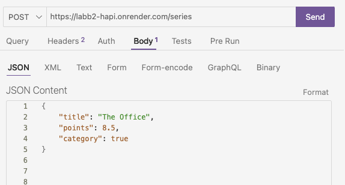
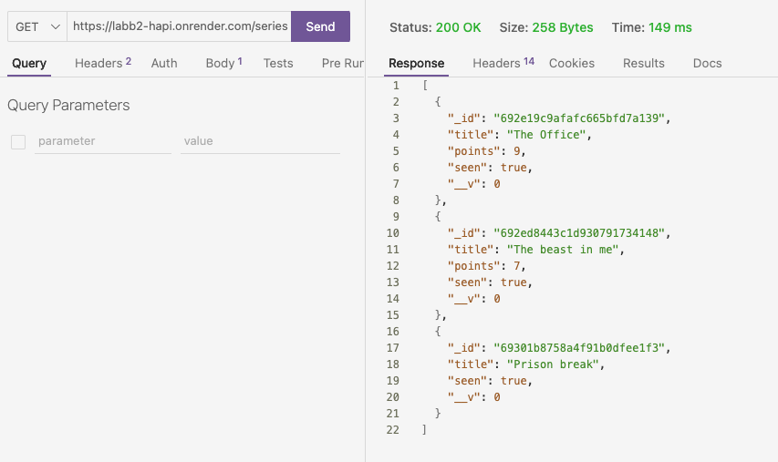

**Vera Kippel veki2400**

Ett API byggt med hapi. 
API:et hanterar en tabell med serier.

API:et är publicerad på [https://labb2-hapi.onrender.com/series](URL) med hjälp av Render.

Tabellens namn heter "series" som skapats med hjälp av MongoDB och mongoose.  
Tabellens innehåll:
- _id
- title(string)
- points(number)
- seen(boolean)
- __v: 0 (som skapas automatiskt av mongodb)


Användning:

|Metod | Ändpunkt | Beskrivning |
-------|----------|-------------|
|GET | "/" | Visar ett välkomstmeddelande|
|GET | "/series" | Hämta alla lagrade serier|
|GET | "/series/{id}" | Hämtar en specifik serie med angivet id|
|POST | "/series" | Lägger till en serie|
|PUT | "/series/{id}" | Uppdaterar en serie med angivet id|
|DELETE | "/series/{id}" | Radera en serie med angivet id|

Seriens JSON-struktur kan se ut såhär:
```json
{
    "title": "The Office",
    "points": 8.5,
    "category": true
}
```

Exempel för testning:
För att testa POST: ange metod POST, skriv [https://labb2-hapi.onrender.com/series](URL) och lägg in ovan json i body.  

För att hämta alla serier med GET: ange metod GET, skriv [https://labb2-hapi.onrender.com/series](URL)  

